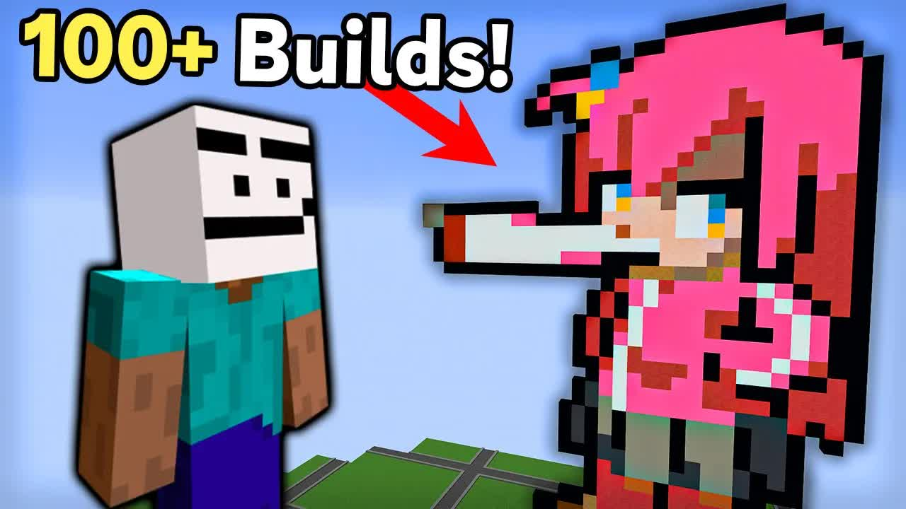

# AI-Generated-Minecraft-Builds

  <picture>
    
  </picture>

 

---

## Video Information

| Property | Value |
|----------|-------|
| **Video Name** | `AI-Generated-Minecraft-Builds` |
| **Original Link** | [YouTube Video](https://www.youtube.com/watch?v=M1qOQolra9k) |
| **Total Size** | **7 parts** - **291.06 MB** |
| **Quality** | **480** |
| **Status** | **Complete (100%)** |
| **Password Protected** | **NO** |

---

## Download Links

> ⬇️ Download **all parts**, then open `AI-Generated-Minecraft-Builds.zip` — the other parts are found automatically.

| # | File | Link |
|---|------|------|
| 1 | `AI-Generated-Minecraft-Builds.z01` | [Download](https://raw.githubusercontent.com/KianSolar/Ourtube/main/videos/AI-Generated-Minecraft-Builds/AI-Generated-Minecraft-Builds.z01) |
| 2 | `AI-Generated-Minecraft-Builds.z02` | [Download](https://raw.githubusercontent.com/KianSolar/Ourtube/main/videos/AI-Generated-Minecraft-Builds/AI-Generated-Minecraft-Builds.z02) |
| 3 | `AI-Generated-Minecraft-Builds.z03` | [Download](https://raw.githubusercontent.com/KianSolar/Ourtube/main/videos/AI-Generated-Minecraft-Builds/AI-Generated-Minecraft-Builds.z03) |
| 4 | `AI-Generated-Minecraft-Builds.z04` | [Download](https://raw.githubusercontent.com/KianSolar/Ourtube/main/videos/AI-Generated-Minecraft-Builds/AI-Generated-Minecraft-Builds.z04) |
| 5 | `AI-Generated-Minecraft-Builds.z05` | [Download](https://raw.githubusercontent.com/KianSolar/Ourtube/main/videos/AI-Generated-Minecraft-Builds/AI-Generated-Minecraft-Builds.z05) |
| 6 | `AI-Generated-Minecraft-Builds.z06` | [Download](https://raw.githubusercontent.com/KianSolar/Ourtube/main/videos/AI-Generated-Minecraft-Builds/AI-Generated-Minecraft-Builds.z06) |
| 7 | `AI-Generated-Minecraft-Builds.zip` | [Download](https://raw.githubusercontent.com/KianSolar/Ourtube/main/videos/AI-Generated-Minecraft-Builds/AI-Generated-Minecraft-Builds.zip) |

---

## How to Extract

Download all parts into the **same folder**, then:

| OS | Steps |
|----|-------|
| **Windows** | Double-click `AI-Generated-Minecraft-Builds.zip` — opens in Explorer, WinRAR, or 7-Zip automatically |
| **Mac** | Double-click `AI-Generated-Minecraft-Builds.zip` — extracts with Archive Utility or The Unarchiver |
| **Linux** | `unzip AI-Generated-Minecraft-Builds.zip` or right-click → Extract Here (Ark/File Manager) |
| **Android** | Tap `AI-Generated-Minecraft-Builds.zip` in your file manager — or use [ZArchiver](https://play.google.com/store/apps/details?id=ru.zdevs.zarchiver) |

---

*This tool created by [avasam.ir](https://avasam.ir)*
